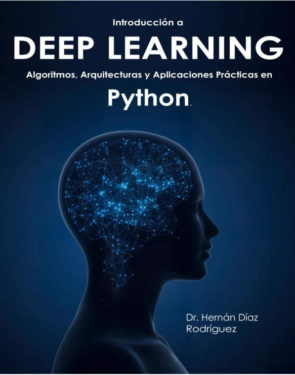

<div align="center">

# Introducción a Deep Learning 📘
### *Del Perceptrón a Stable Diffusion · Un recorrido práctico por la IA moderna*



**Algoritmos, Arquitecturas y Aplicaciones Prácticas en Python**
por **Hernán Díaz Rodríguez, PhD** — Profesor en la Universidad de Oviedo · Ex-investigador del CERN

[](https://github.com/HernanDiaz/deep-learning)
[](https://creativecommons.org/licenses/by-nc/4.0/deed.es)
[](https://www.amazon.es/dp/B0G1HG2CY6)
[](https://www.linkedin.com/in/hernandiazrodriguez)

</div>

---

## 📘 Sobre el libro

**Introducción a Deep Learning** es un recorrido completo y práctico desde el **perceptrón** hasta entrenar tu propio modelo de **Stable Diffusion**. Escrito por un profesor universitario y ex-investigador del CERN, cubre todo el panorama del deep learning moderno — **redes neuronales, redes convolucionales, transformers, GPT, CLIP, GANs, modelos de difusión y aprendizaje por refuerzo** — con explicaciones, código en **Keras y PyTorch**, y un cuaderno interactivo en Colab y un vídeo en YouTube para **cada** capítulo.

Este repositorio contiene los **20 cuadernos interactivos** del libro, listos para ejecutarse en Google Colab.

> 📕 **Disponible en español e inglés** en Amazon, en tapa blanda y Kindle.
> 👉 [Compra el libro en Amazon](https://www.amazon.es/dp/B0G1HG2CY6) · [Página del autor](https://www.amazon.es/Hernan-Diaz-Rodriguez/e/B0GD8JQ9JB)

> 🇬🇧 **Prefer the notebooks in English?** They are available in the [`/en`](./en) folder.

---

## 📂 Estructura del repositorio

```
deep-learning/
├── 1_El_perceptron.ipynb         ← Cuadernos en español (raíz)
├── 2_Perceptron_multicapa.ipynb
├── ...
├── 20_Proximal_Policy_Optimization.ipynb
└── en/                            ← English notebooks
    ├── 1_Perceptron.ipynb
    ├── 2_Multilayer_Perceptron.ipynb
    └── ...
```

---

## 🎯 Qué vas a aprender

El libro y los cuadernos están organizados en **5 partes**:

| Parte | Tema | Capítulos |
|------|------|-----------|
| **1. Redes Clásicas** | Perceptrón, MLP, regresión y clasificación con Keras | 1–5 |
| **2. Visión por Computador** | CNN, transferencia de aprendizaje, segmentación UNET, detección YOLO | 6–9 |
| **3. Transformers y LLMs** | Mecanismo de atención, arquitectura Transformer, GPT, CLIP | 10–13 |
| **4. Modelos Generativos** | GAN, modelos de difusión, Stable Diffusion | 14–15 |
| **5. Aprendizaje por Refuerzo** | MDP, Q-Learning, Deep Q-Networks, PPO | 16–20 |

---

## 🚀 Cómo usar los cuadernos

- Haz clic en **Abrir en Colab** para ejecutar el código de cada capítulo — sin necesidad de instalar nada.
- Haz clic en **Ver vídeo** para ver la explicación en YouTube.
- Sigue el libro mientras experimentas con los ejemplos.
- Si prefieres ejecutarlos en local, los requisitos están indicados en cada cuaderno.

---

## 📚 Notebooks y vídeos

| Cap. | Título | Colab | Vídeo |
|------|--------|-------|-------|
| 1 | Perceptrón y Redes Básicas | [](https://colab.research.google.com/github/HernanDiaz/deep-learning/blob/main/1_El_perceptron.ipynb) | [](https://youtu.be/Ijku90nKThk) |
| 2 | Redes Feedforward y MLP | [](https://colab.research.google.com/github/HernanDiaz/deep-learning/blob/main/2_Perceptron_multicapa.ipynb) | [](https://youtu.be/kWLW1ByUSjM) |
| 3 | Regresión con Keras | [](https://colab.research.google.com/github/HernanDiaz/deep-learning/blob/main/3_Regresion.ipynb) | [](https://youtu.be/RXZTqe2WwBA) |
| 4 | Clasificación Multiclase | [](https://colab.research.google.com/github/HernanDiaz/deep-learning/blob/main/4_Clasificacion_multiclase.ipynb) | [](https://youtu.be/xnhHdtp-KDw) |
| 5 | Regularización e Hiperparámetros | [](https://colab.research.google.com/github/HernanDiaz/deep-learning/blob/main/5_Regularización_y_configuración_de_hiperparametros.ipynb) | [](https://youtu.be/Yim0IDVUujs) |
| 6 | Redes Convolucionales (CNN) | [](https://colab.research.google.com/github/HernanDiaz/deep-learning/blob/main/6_Redes_Convolucionales_CNN.ipynb) | [](https://youtu.be/DYAKMFhRoxI) |
| 7 | Aprendizaje por Transferencia | [](https://colab.research.google.com/github/HernanDiaz/deep-learning/blob/main/7_Aprendizaje_por_transferencia.ipynb) | [](https://youtu.be/2N6qwsmhXBE) |
| 8 | Segmentación con UNET | [](https://colab.research.google.com/github/HernanDiaz/deep-learning/blob/main/8_Segmentacion_UNET.ipynb) | [](https://youtu.be/DOOmfMOyvOI) |
| 9 | Detección de Objetos (YOLO) | [](https://colab.research.google.com/github/HernanDiaz/deep-learning/blob/main/9_Deteccion_de_objetos_con_YOLO.ipynb) | [](https://youtu.be/ersYGhxJopY) |
| 10 | El Mecanismo de Atención | [](https://colab.research.google.com/github/HernanDiaz/deep-learning/blob/main/10_El_mecanismo_de_atencion.ipynb) | [](https://youtu.be/breq_qgXc2Y) |
| 11 | Transformer | [](https://colab.research.google.com/github/HernanDiaz/deep-learning/blob/main/11_Transformer.ipynb) | [](https://youtu.be/Wz-92p5RnH8) |
| 12 | Generative Pre-trained Transformer (GPT) | [](https://colab.research.google.com/github/HernanDiaz/deep-learning/blob/main/12_Generative_Pre_trained_Transformer_GPT.ipynb) | [](https://youtu.be/Ifvt5R1PKrU) |
| 13 | Modelos Multimodales (CLIP) | [](https://colab.research.google.com/github/HernanDiaz/deep-learning/blob/main/13_Modelos_multimodales_CLIP.ipynb) | [](https://youtu.be/nIrwzqisqSM) |
| 14 | Redes Generativas Adversarias (GAN) | [](https://colab.research.google.com/github/HernanDiaz/deep-learning/blob/main/14_Redes_Generativas_Adversarias_GAN.ipynb) | [](https://youtu.be/Yp5KnHBkR-4) |
| 15 | Modelos de Difusión (Stable Diffusion) | [](https://colab.research.google.com/github/HernanDiaz/deep-learning/blob/main/15_Modelos_de_difusion_Stable_Diffusion.ipynb) | [](https://youtu.be/gtPzjlAVuhc) |
| 16 | Aprendizaje por Refuerzo: Exploración vs Explotación | [](https://colab.research.google.com/github/HernanDiaz/deep-learning/blob/main/16_Aprendizaje_por_refuerzo_Explotacion_vs_Exploracion.ipynb) | [](https://youtu.be/4lZFlqrrIIA) |
| 17 | Procesos de Decisión de Markov | [](https://colab.research.google.com/github/HernanDiaz/deep-learning/blob/main/17_Procesos_de_decisión_de_Markov.ipynb) | [](https://youtu.be/w0nQvKV-Y3c) |
| 18 | Q-Learning | [](https://colab.research.google.com/github/HernanDiaz/deep-learning/blob/main/18_Q_Learning.ipynb) | [](https://youtu.be/jIAsCnooP10) |
| 19 | Deep Q-Learning | [](https://colab.research.google.com/github/HernanDiaz/deep-learning/blob/main/19_Deep_Q_Learning.ipynb) | [](https://youtu.be/rm3FeCXAL_0) |
| 20 | Proximal Policy Optimization (PPO) | [](https://colab.research.google.com/github/HernanDiaz/deep-learning/blob/main/20_Proximal_Policy_Optimization.ipynb) | [](https://youtu.be/LpFfeFrCuf0) |

---

## 🏷️ Temas que cubre este repositorio

`aprendizaje-profundo` · `deep-learning` · `redes-neuronales` · `python` · `pytorch` · `keras` · `tensorflow` · `inteligencia-artificial` · `machine-learning` · `transformers` · `mecanismo-de-atencion` · `gpt` · `clip` · `large-language-models` · `vision-por-computador` · `cnn` · `unet` · `yolo` · `segmentacion-imagen` · `deteccion-de-objetos` · `gan` · `stable-diffusion` · `modelos-de-difusion` · `ia-generativa` · `aprendizaje-por-refuerzo` · `q-learning` · `deep-q-network` · `ppo` · `policy-gradient` · `notebooks-colab` · `libro-ia-espanol`

---

## 👨‍🏫 Sobre el autor

**Hernán Díaz Rodríguez** es Profesor del Departamento de Ciencias de la Computación e Inteligencia Artificial de la **Universidad de Oviedo**, donde obtuvo su Doctorado en Informática. Ingeniero en Informática por la misma institución y **MBA por Open University (Reino Unido)**.

Cuenta con más de 20 años de experiencia en los sectores público y privado, desarrollando proyectos de tecnología e investigación avanzada. Destacan sus **5 años de trabajo en el CERN**, el Centro Europeo de Investigación Nuclear, uno de los mayores laboratorios científicos del mundo.

[💼 LinkedIn](https://www.linkedin.com/in/hernandiazrodriguez) · [📧 Correo](mailto:hernan.diaz.rodriguez@gmail.com) · [📕 Página de autor en Amazon](https://www.amazon.es/Hernan-Diaz-Rodriguez/e/B0GD8JQ9JB)

---

## ⭐ ¿Te ha resultado útil?

Si estos cuadernos te están ayudando a aprender deep learning, puedes apoyar el proyecto:

- ⭐ **Dejando una estrella** en este repositorio — ayuda a que otros lo descubran.
- 📕 **Adquiriendo el libro** para acceder a todo el contenido teórico completo: [Comprar en Amazon](https://www.amazon.es/dp/B0G1HG2CY6)
- 💬 **Compartiéndolo** con un compañero, estudiante o profesor al que pueda interesarle.

¡Gracias! 🙏

---

## 🧾 Licencia

Este material se distribuye bajo [**Creative Commons Attribution-NonCommercial 4.0 International (CC BY-NC 4.0)**](https://creativecommons.org/licenses/by-nc/4.0/deed.es).

✅ **Permitido:** uso para docencia, estudio o apuntes personales; adaptaciones con fines educativos, **citando al autor**.
❌ **No permitido:** uso comercial o lucrativo; redistribución en productos comerciales sin permiso.

---

## 📖 Cómo citar

Si utilizas este material en un trabajo académico, por favor cita:

```bibtex
@book{diazrodriguez2025introduccion,
  author    = {Hern{\'a}n D{\'\i}az Rodr{\'\i}guez},
  title     = {Introducci{\'o}n a Deep Learning: Algoritmos, Arquitecturas y Aplicaciones Pr{\'a}cticas en Python},
  year      = {2025},
  publisher = {Publicaci{\'o}n independiente},
  url       = {https://github.com/HernanDiaz/deep-learning}
}
```

---

## 📬 Contacto

¿Has detectado un error o tienes una sugerencia? Me encantará leerte:
📧 **hernan.diaz.rodriguez@gmail.com**

Para adopción institucional del libro en cursos o programas docentes, indica tu institución y la asignatura en el correo — estaré encantado de apoyar a docentes.
