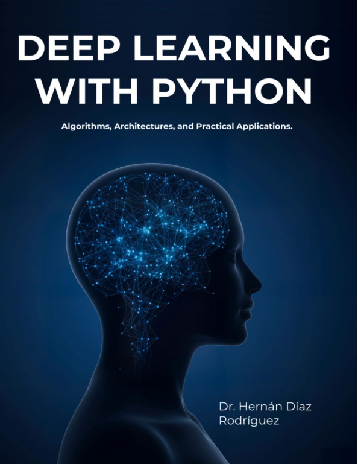

<div align="center">

# Deep Learning with Python 🧠
### *From the Perceptron to Stable Diffusion · A Hands-On Journey through Modern AI*



**Algorithms, Architectures, and Practical Applications**
by **Hernán Díaz Rodríguez, PhD** — Professor at the University of Oviedo · Former CERN researcher

[](https://github.com/HernanDiaz/deep-learning)
[](https://creativecommons.org/licenses/by-nc/4.0/)
[](https://www.amazon.es/dp/B0G1HG2CY6)
[](https://www.amazon.com/dp/B0G1HG2CY6)
[](https://www.linkedin.com/in/hernandiazrodriguez)

</div>

---

## 📘 About this book

**Deep Learning with Python** is a complete, hands-on journey from the **perceptron** to training your own **Stable Diffusion** model. Written by a university professor and former CERN researcher, it covers the full landscape of modern deep learning — **neural networks, convolutional networks, transformers, GPT, CLIP, GANs, diffusion models and reinforcement learning** — with explanations, working code in **Keras and PyTorch**, and an interactive Colab notebook and YouTube video for **every** chapter.

This repository contains the **20 interactive notebooks** of the book, ready to run in Google Colab.

> 📕 **Available in Spanish and English** on Amazon, in paperback and Kindle.
> 👉 [Get the book on Amazon](https://www.amazon.es/dp/B0G1HG2CY6) · [Author profile](https://www.amazon.es/Hernan-Diaz-Rodriguez/e/B0GD8JQ9JB)

---

## 🎯 What you will learn

The book and notebooks are organized in **5 parts**:

| Part | Topic | Chapters |
|------|-------|----------|
| **1. Classical Networks** | Perceptron, MLP, regression, classification with Keras | 1–5 |
| **2. Computer Vision** | CNNs, transfer learning, UNET segmentation, YOLO detection | 6–9 |
| **3. Transformers & LLMs** | Attention, Transformer architecture, GPT, CLIP | 10–13 |
| **4. Generative Models** | GANs, diffusion models, Stable Diffusion | 14–15 |
| **5. Reinforcement Learning** | MDPs, Q-Learning, Deep Q-Networks, PPO | 16–20 |

---

## 🚀 How to use the notebooks

- Click **Open in Colab** to run the code for each chapter — no installation needed.
- Click **Watch Video** to see the chapter explained on YouTube.
- Follow along with the book while experimenting with the examples.
- If you want to run the notebooks locally, requirements are listed inside each notebook.

---

## 📝 Notebooks and videos

| # | Chapter | Colab | Video |
|---|---------|-------|-------|
| 1 | Perceptron and Basic Networks | [](https://colab.research.google.com/github/HernanDiaz/deep-learning/blob/main/en/1_Perceptron.ipynb) | [](https://youtu.be/Ef0bRgKsX2I) |
| 2 | Feedforward Networks and MLP | [](https://colab.research.google.com/github/HernanDiaz/deep-learning/blob/main/en/2_Multilayer_Perceptron.ipynb) | [](https://youtu.be/LBXwO19P_WE) |
| 3 | Regression with Keras | [](https://colab.research.google.com/github/HernanDiaz/deep-learning/blob/main/en/3_Regression.ipynb) | [](https://youtu.be/6wk6qMZvD8A) |
| 4 | Multiclass Classification | [](https://colab.research.google.com/github/HernanDiaz/deep-learning/blob/main/en/4_Multiclass_classification.ipynb) | [](https://youtu.be/OUPilUMkM-M) |
| 5 | Regularization and Hyperparameter Tuning | [](https://colab.research.google.com/github/HernanDiaz/deep-learning/blob/main/en/5_Regularization_Hyperparameter_Configuration.ipynb) | [](https://youtu.be/WYhHM_7Bjv8) |
| 6 | Convolutional Neural Networks (CNN) | [](https://colab.research.google.com/github/HernanDiaz/deep-learning/blob/main/en/6_Convolutional_Neural_Networks.ipynb) | [](https://youtu.be/krU3ZzQDNS0) |
| 7 | Transfer Learning | [](https://colab.research.google.com/github/HernanDiaz/deep-learning/blob/main/en/7_Transfer_Learning.ipynb) | [](https://youtu.be/pscQOeTPGuE) |
| 8 | Segmentation with UNET | [](https://colab.research.google.com/github/HernanDiaz/deep-learning/blob/main/en/8_Segmentation_UNET.ipynb) | [](https://youtu.be/ccJFJsGe81M) |
| 9 | Object Detection (YOLO) | [](https://colab.research.google.com/github/HernanDiaz/deep-learning/blob/main/en/9_Object_Detection_YOLO.ipynb) | [](https://youtu.be/0AOq_CXtZsk) |
| 10 | Attention Mechanism | [](https://colab.research.google.com/github/HernanDiaz/deep-learning/blob/main/en/10_The_attention_mechanism.ipynb) | [](https://youtu.be/lHQKHzyuSZ8) |
| 11 | Transformer | [](https://colab.research.google.com/github/HernanDiaz/deep-learning/blob/main/en/11_Transformer.ipynb) | [](https://youtu.be/2Iuu9MFATlE) |
| 12 | Generative Pre-trained Transformer (GPT) | [](https://colab.research.google.com/github/HernanDiaz/deep-learning/blob/main/en/12_Generative_Pre-trained_Transformer_GPT.ipynb) | [](https://youtu.be/0F9NQDsvJ1g) |
| 13 | Multimodal Models (CLIP) | [](https://colab.research.google.com/github/HernanDiaz/deep-learning/blob/main/en/13_Multimodal_Models_CLIP.ipynb) | [](https://youtu.be/9nZyFfPAUJs) |
| 14 | Generative Adversarial Networks (GAN) | [](https://colab.research.google.com/github/HernanDiaz/deep-learning/blob/main/en/14_Generative_Adversarial_Networks_GAN.ipynb) | [](https://youtu.be/Th0L0aMe6eE) |
| 15 | Stable Diffusion | [](https://colab.research.google.com/github/HernanDiaz/deep-learning/blob/main/en/15_Stable_Diffusion.ipynb) | [](https://youtu.be/MzqqMlfDscQ) |
| 16 | Reinforcement Learning: Exploration vs Exploitation | [](https://colab.research.google.com/github/HernanDiaz/deep-learning/blob/main/en/16_Reinforcement_Learning.ipynb) | [](https://youtu.be/AWBPmfjFOPU) |
| 17 | Markov Decision Processes (MDP) | [](https://colab.research.google.com/github/HernanDiaz/deep-learning/blob/main/en/17_Markov_Decision_Problem_MDP.ipynb) | [](https://youtu.be/OBx-NZKKbbY) |
| 18 | Q-Learning | [](https://colab.research.google.com/github/HernanDiaz/deep-learning/blob/main/en/18_Q_Learning.ipynb) | [](https://youtu.be/yBfH6CA9m0s) |
| 19 | Deep Q-Learning | [](https://colab.research.google.com/github/HernanDiaz/deep-learning/blob/main/en/19_Deep_Q_Learning.ipynb) | [](https://youtu.be/lSUQLJO5PW8) |
| 20 | Proximal Policy Optimization (PPO) | [](https://colab.research.google.com/github/HernanDiaz/deep-learning/blob/main/en/20_Proximal_Policy_Optimization_PPO.ipynb) | [](https://youtu.be/WPcua5ITGho) |

> 🇪🇸 ¿Prefieres los notebooks en español? Están en la carpeta [`/es`](./es).

---

## 🏷️ Topics covered

`deep-learning` · `neural-networks` · `python` · `pytorch` · `keras` · `tensorflow` · `machine-learning` · `artificial-intelligence` · `transformers` · `attention-mechanism` · `gpt` · `clip` · `large-language-models` · `computer-vision` · `cnn` · `unet` · `yolo` · `image-segmentation` · `object-detection` · `gan` · `generative-adversarial-network` · `stable-diffusion` · `diffusion-models` · `generative-ai` · `reinforcement-learning` · `q-learning` · `deep-q-network` · `ppo` · `policy-gradient` · `colab-notebooks`

---

## 👨‍🏫 About the author

**Hernán Díaz Rodríguez** is a Professor in the Department of Computer Science and Artificial Intelligence at the **University of Oviedo**, Spain, where he obtained his PhD in Computer Science. He holds an MSc in Computer Engineering from the same institution and an **MBA from Open University (United Kingdom)**.

With more than 20 years of experience across the public and private sectors, he has worked on advanced technology and research projects, including **5 years at CERN**, the European Organization for Nuclear Research — one of the world's largest scientific laboratories.

[💼 LinkedIn](https://www.linkedin.com/in/hernandiazrodriguez) · [📧 Email](mailto:hernan.diaz.rodriguez@gmail.com) · [📕 Amazon author page](https://www.amazon.es/Hernan-Diaz-Rodriguez/e/B0GD8JQ9JB)

---

## ⭐ Found this useful?

If these notebooks have helped you learn deep learning, please consider:

- ⭐ **Starring this repository** — it helps others discover the material.
- 📕 **Getting the book** to support the work and access the full theoretical content: [Amazon ES](https://www.amazon.es/dp/B0G1HG2CY6) · [Amazon US](https://www.amazon.com/dp/B0G1HG2CY6)
- 💬 **Sharing** with a colleague, student or professor who could benefit.

Thank you! 🙏

---

## 📜 License

This material is distributed under [**Creative Commons Attribution-NonCommercial 4.0 International (CC BY-NC 4.0)**](https://creativecommons.org/licenses/by-nc/4.0/).

✅ **Allowed:** teaching, studying, personal notes, adaptations for educational purposes (citing the author).
❌ **Not allowed:** commercial or for-profit use, redistribution in commercial products without permission.

---

## 📖 How to cite

If you use these materials in academic work, please cite:

```bibtex
@book{diazrodriguez2025deeplearning,
  author    = {Hern{\'a}n D{\'\i}az Rodr{\'\i}guez},
  title     = {Deep Learning with Python: Algorithms, Architectures, and Practical Applications},
  year      = {2025},
  publisher = {Independently published},
  url       = {https://github.com/HernanDiaz/deep-learning}
}
```

---

## ✉️ Contact

Found an error or have a suggestion? I'd love to hear from you:
📧 **hernan.diaz.rodriguez@gmail.com**

For institutional adoption of the book in courses or programs, please mention your institution and course in the email — I'm happy to support educators.
